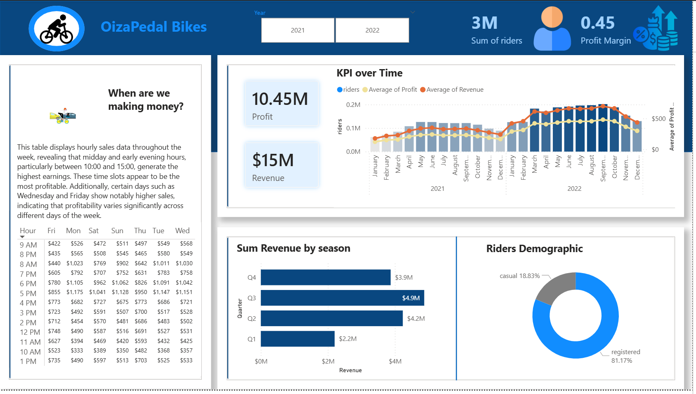

# OizaPedal Bikes - Business Intelligence Dashboard

## 📊 Project Overview

An interactive business intelligence dashboard analyzing bike-sharing operations for OizaPedal Bikes across 2021-2022. This project provides actionable insights into revenue optimization, customer behavior, and operational efficiency.

## 🎯 Key Findings

### Financial Performance
- **Total Revenue**: $15M across 2021-2022
- **Total Profit**: $10.45M
- **Profit Margin**: 45% (0.45)
- **Total Riders**: 3M users

### Operational Insights

#### 🕐 Peak Profitability Hours
The analysis reveals that **10:00 AM - 3:00 PM** generates the highest earnings:
- 10 AM: Average ~$350-500 across all days
- 12 PM: Peak performance with $700-1,100+ revenue
- 2 PM: Sustained high performance ($450-700)

**Business Recommendation**: Increase bike availability and staffing during midday hours to maximize revenue capture.

#### 📅 Day-of-Week Patterns
- **Wednesday & Friday**: Highest performing days
- **Weekend Performance**: Moderate to strong, indicating both commuter and leisure usage

#### 🌡️ Seasonal Trends
Revenue by quarter shows clear seasonality:
1. **Q4**: $3.9M (Strongest quarter)
2. **Q3**: $4.9M
3. **Q2**: $4.2M
4. **Q1**: $2.2M (Weakest quarter - winter impact)

#### 👥 Customer Demographics
- **Registered Users**: 81.17% (loyal customer base)
- **Casual Users**: 18.83% (growth opportunity)

**Business Recommendation**: Develop strategies to convert casual riders to registered users through loyalty programs and subscription incentives.

## 📈 Trend Analysis

The KPI over Time chart shows:
- Steady growth from January 2021 through mid-2022
- Peak performance around August-September 2022
- Slight decline in late 2022 (seasonal or market factors)
- Revenue and profit trends closely aligned, indicating consistent operational efficiency

## 🎯 Market Analysis & Strategic Recommendations

### Competitive Landscape & Pricing Strategy

**Conservative Market Base Considerations:**
- The bike-sharing market demonstrates substantial growth potential, with projections indicating a **10%-15% year-over-year increase** in rider demand
- Current pricing strategy appears conservative, suggesting significant room for optimization

**Recommended Strategic Actions:**

1. **Price Adjustment Analysis**: Conduct further market research to understand customer satisfaction and price sensitivity. Current data suggests the market could sustain a **10% price increase** without significant loss of customers.

2. **Dynamic Pricing Implementation**: 
   - Leverage peak hour insights (10:00 AM - 3:00 PM) for premium pricing
   - Implement surge pricing during high-demand periods
   - Offer discounted rates during off-peak hours to balance demand

3. **Competitive Positioning**: Monitor competitor pricing and service offerings to maintain market competitiveness while maximizing revenue

4. **Value Enhancement**: Consider service improvements that justify premium pricing, such as enhanced bike quality, better availability, or additional customer benefits

## 🛠️ Tools & Technologies

- **Data Visualization**: Power BI
- **Data Analysis**: Power BI / SQL
- **Data Sources**: Bike-sharing operational data (2021-2022)

## 💡 Business Impact

This dashboard enables data-driven decisions for:
1. **Resource Allocation**: Optimize bike distribution based on time-of-day patterns
2. **Pricing Strategy**: Implement dynamic pricing during peak hours
3. **Marketing Focus**: Target casual riders for conversion campaigns
4. **Seasonal Planning**: Prepare for Q1 revenue dips with targeted promotions

## 🚀 Future Enhancements

- [ ] Real-time data integration
- [ ] Predictive analytics for demand forecasting
- [ ] Geographic analysis by station/location
- [ ] Weather impact analysis
- [ ] Customer segmentation deep-dive

## 📧 Contact

Feel free to reach out for collaboration or questions about this project!

- **LinkedIn**: [linkedin.com/in/amudipeayomide](https://linkedin.com/in/amudipeayomide)
- **Email**: amudipeayomide@gmail.com

⭐ If you find this project useful, please consider giving it a star!

